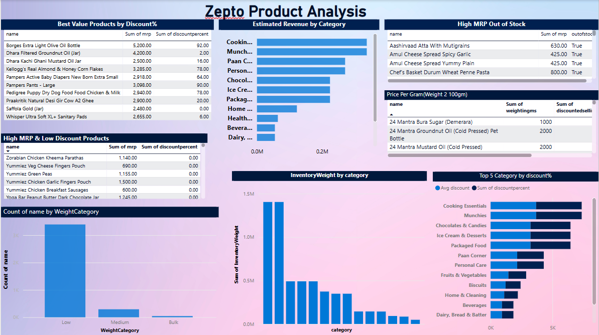

🛒 Zepto Inventory Analytics Dashboard

A powerful SQL-driven e-commerce data analysis project simulating real-world inventory insights for Zepto — one of India’s fastest-growing quick-commerce startups. This project uncovers pricing inefficiencies, stock insights, and discount-driven opportunities through SQL querying and structured data storytelling.

✨ Short Description / Purpose

The Zepto Inventory Analytics project is a comprehensive SQL-based analysis created to explore patterns in pricing, availability, discounts, and product categorization across Zepto’s live inventory. This project helps aspiring data analysts simulate real-life problem-solving in the retail/e-commerce domain.

⚙️ Tech Stack

The project was built using the following tools and technologies:

🗃️ PostgreSQL – Database used to host and query the dataset

🖥️ pgAdmin – GUI for database management and import

📈 SQL (Structured Query Language) – Used for all data analysis, aggregation, filtering, and business logic

📄 CSV – Data file format (converted to UTF-8 for import)

📊 (Optional) Power BI / Excel – Can be used for visualizing final output (not required)

🗂️ Data Source

Source: Dataset scraped from Zepto and hosted on Kaggle – Zepto Inventory Dataset

Format: ~20,000+ rows of product listings, each representing a unique SKU (Stock Keeping Unit)

Columns Include:

sku_id – Unique product ID

name – Product title

category – Product group (e.g., Fruits, Dairy, Snacks)

mrp, discountPercent, discountedSellingPrice – Price columns in ₹

availableQuantity, outOfStock – Inventory levels

weightInGms, quantity – Product size/packaging indicators

🔍 Features / Highlights

• Business Problem
Zepto’s product listings are messy and inconsistent, with multiple SKUs for similar products, invalid price entries, and inconsistent availability statuses. Business users lack visibility into where pricing inefficiencies, stock-outs, or high-revenue categories lie.

• Goal of the Project

To simulate how an e-commerce analyst uses SQL to:

Clean and standardize data

Discover trends in pricing, discounting, and stock levels

Identify business opportunities and performance gaps across product categories

• Walkthrough of Key Insights & Queries

📦 Inventory Health

Compared in-stock vs out-of-stock items to determine category reliability

Grouped product weights into Low, Medium, Bulk for segmentation

💰 Pricing Analysis

Converted prices from paise to rupees for consistency

Calculated price per gram to identify best value-for-money products

Filtered expensive products (MRP > ₹500) with little or no discount

🛍️ Discount & Revenue Metrics

Ranked top 10 products by discount percent

Estimated potential revenue by product category

Found categories with highest average discounts (for pricing strategy)

📊 Sample Query – Top Discounted Categories

sql
Copy
Edit
SELECT category, ROUND(AVG(discountPercent), 2) AS avg_discount
FROM zepto
GROUP BY category
ORDER BY avg_discount DESC
LIMIT 5;

📸 Screenshots / Demos
## 📸 Zepto Dashboard – Power BI Visualization

Here’s a preview of the dashboard built to analyze Zepto’s inventory data.

